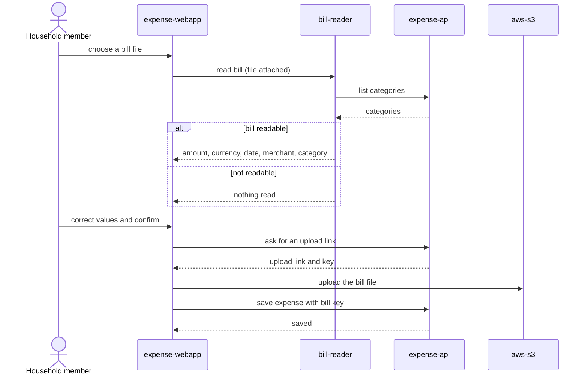

# Bill to expense

A household member uploads a bill; an agent reads it, the member checks the values, and the saved expense keeps the bill.

```mermaid
sequenceDiagram
    actor Member as Household member
    participant expense-webapp
    participant bill-reader
    participant expense-api
    participant aws-s3

    Member->>expense-webapp: choose a bill file
    expense-webapp->>bill-reader: read bill (file attached)
    bill-reader->>expense-api: list categories
    expense-api-->>bill-reader: categories
    alt bill readable
        bill-reader-->>expense-webapp: amount, currency, date, merchant, category
    else not readable
        bill-reader-->>expense-webapp: nothing read
    end
    Member->>expense-webapp: correct values and confirm
    expense-webapp->>expense-api: ask for an upload link
    expense-api-->>expense-webapp: upload link and key
    expense-webapp->>aws-s3: upload the bill file
    expense-webapp->>expense-api: save expense with bill key
    expense-api-->>expense-webapp: saved
```